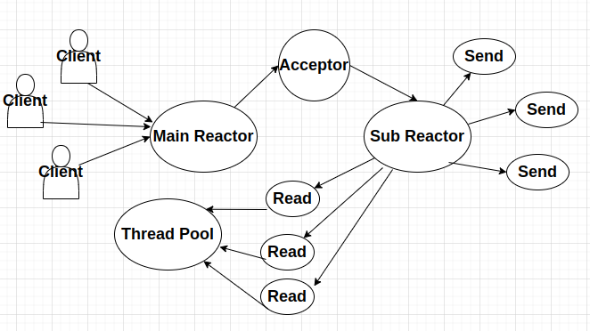

# TinyServer

会开发cpp（已完成）和rust两个版本，附上相应的tutorial

[](https://discord.gg/8jCKt9rTtN)

# 项目特点

- 底层使用 Epoll + LT 模式的 I/O 复用模型，并且结合非阻塞 I/O 实现主从 Reactor 模型

- 数据库连接池可以动态管理连接数量，及时生成或销毁连接，保证连接池性能

- 实现了内存池模块，更好管理小块内存空间，减少内存碎片

- 利用有限状态机解析 HTTP 请求报文，支持解析GET和POST请求。访问服务器MySQL数据库实现用户注册、登录功能，可以请求服务器图片和视频文件

- 基于自实现的双缓冲区实现异步日志，由后端线程负责定时向磁盘写入前端日志信息，避免数据落盘时阻塞网络服务

# 并发模型



# 编译运行

编译:

```bash
mkdir build && cd build
cmake ..
make
```

单元测试:

```bash
./unit_tests
```

性能测试:

```bash
./benchmark_tcp_server
```

运行HTTP服务器：

我们可以在一个终端运行：

```bash
./http_server
```

再打开一个终端运行：

```bash
curl http://127.0.0.1:8080/
```

这样会收到**Hello World!**的响应

如果数据库环境也配置好了，可以运行：

```bash
curl -X POST -d "username=testuser&password=testpass" http://127.0.0.1:8080/register
```

这会发送一个包含 username 和 password 的 POST 请求来注册新用户。

```bash
curl -X POST -d "username=testuser&password=testpass" http://127.0.0.1:8080/login
```
这会发送一个 POST 请求来登录用户。


# 优化和拓展思路（TODO LISTS）

1. Reactor 模式： 
- 使用智能指针管理资源。
- 添加错误处理和日志记录。
- 实现定时器功能。
- 支持写事件。
- 使用线程池处理长时间运行的任务。

2. 网络通信功能：

- 实现 UDP 服务器（类似的方式，但使用 SOCK_DGRAM）。
- 创建一个通用的 Protocol 类，用于处理不同的协议（如 HTTP、WebSocket 等）。
- 实现客户端功能，允许主动建立连接和发送数据。
- 添加 SSL/TLS 支持，提高安全性。
- 实现更高级的错误处理和日志记录。

3. 序列化与反序列化
- 添加对复杂数据结构（如数组、映射等）的支持。
- 实现版本控制机制，以支持向后兼容性。
- 添加压缩功能以减少数据大小。
- 实现对自定义类型的序列化支持。
- 考虑使用更高效的编码方式，如变长整数编码。
- 添加校验和或其他错误检测机制。

4. 连接池和内存池

- 为连接池添加空闲连接超时和定期健康检查。
- 在内存池中实现不同大小的内存块分配。
- 添加性能统计和监控功能。
- 实现自动扩展和收缩池大小的策略。
- 为内存池添加内存对齐支持，以优化缓存使用。

5. 实现服务发现和负载均衡功能。

- 实现更复杂的负载均衡策略，如加权轮询、最少连接数等。
- 添加服务健康检查机制。
- 实现动态服务发现，如集成 etcd 或 Consul。
- 添加服务版本管理和兼容性检查。
- 实现服务熔断和限流功能。
- 添加缓存层以提高服务发现的性能。
- 实现分布式一致性协议，如 Raft，以确保服务注册表的高可用性。

6. 开发监控和日志系统。

- 添加结构化日志支持，便于后续分析。
- 实现日志轮转功能，防止日志文件过大。
- 添加更多的指标类型，如百分位数、移动平均等。
- 实现指标的定期导出功能，以便与外部监控系统集成。
- 添加分布式追踪功能，以便在分布式系统中跟踪请求流程。
- 添加警报功能，当某些指标超过阈值时发送通知。